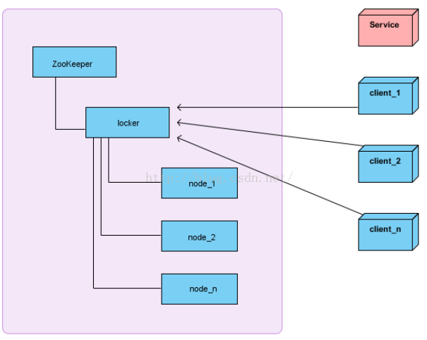
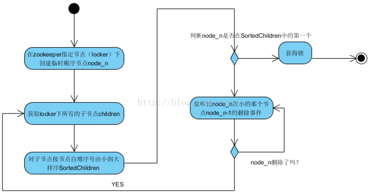

一、分布式锁介绍

　　zookeeper是hadoop下面的一个子项目, 用来协调跟hadoop相关的一些分布式的框架, 如hadoop, hive, pig等,

　　zookeeper其实是集群中每个节点都维护着一棵相同的树, 树的结构跟linux的目录结构的概念差不多, 
以/为跟节点, 下边可以扩展任意的节点和叶子节点, 每个节点都可以写入数据. 
基于zookeeper的分布式锁的实现, 其实是得益于zookeeper同步文件的强大性, 
我们相信每时每刻我们访问zookeeper的树时, 相同节点返回的数据都是一致的. 
这要靠zookeeper内部的一些算法来实现. 特别是leader的选举算法, 


　　分布式锁主要用于在分布式环境中保护跨进程、跨主机、跨网络的共享资源实现互斥访问，
以达到保证数据的一致性。

二、架构介绍

　　在介绍使用Zookeeper实现分布式锁之前，首先看当前的系统架构图



　　解释： 左边的整个区域表示一个Zookeeper集群，locker是Zookeeper的一个持久节点，
node_1、node_2、node_3是locker这个持久节点下面的临时顺序节点。client_1、client_2、client_n表示多个客户端，
Service表示需要互斥访问的共享资源。

三、分布式锁获取思路

　　1．获取分布式锁的总体思路

　　在获取分布式锁的时候在locker节点下创建临时顺序节点，释放锁的时候删除该临时节点。
客户端调用createNode方法在locker下创建临时顺序节点，
然后调用getChildren(“locker”)来获取locker下面的所有子节点，注意此时不用设置任何Watcher。
客户端获取到所有的子节点path之后，如果发现自己在之前创建的子节点序号最小，
那么就认为该客户端获取到了锁。如果发现自己创建的节点并非locker所有子节点中最小的，
说明自己还没有获取到锁，此时客户端需要找到比自己小的那个节点，然后对其调用exist()方法，
同时对其注册事件监听器。之后，让这个被关注的节点删除，则客户端的Watcher会收到相应通知，
此时再次判断自己创建的节点是否是locker子节点中序号最小的，如果是则获取到了锁，
如果不是则重复以上步骤继续获取到比自己小的一个节点并注册监听。
当前这个过程中还需要许多的逻辑判断。

 

2．获取分布式锁的核心算法流程

　　下面同个一个流程图来分析获取分布式锁的完整算法，如下：



　　解释：客户端A要获取分布式锁的时候首先到locker下创建一个临时顺序节点（node_n），
然后立即获取locker下的所有（一级）子节点。
此时因为会有多个客户端同一时间争取锁，因此locker下的子节点数量就会大于1。
对于顺序节点，特点是节点名称后面自动有一个数字编号，先创建的节点数字编号小于后创建的，
因此可以将子节点按照节点名称后缀的数字顺序从小到大排序，
这样排在第一位的就是最先创建的顺序节点，此时它就代表了最先争取到锁的客户端！

　　此时判断最小的这个节点是否为客户端A之前创建出来的node_n，如果是则表示客户端A获取到了锁，
如果不是则表示锁已经被其它客户端获取，因此客户端A要等待它释放锁，
也就是等待获取到锁的那个客户端B把自己创建的那个节点删除。

　　此时就通过监听比node_n次小的那个顺序节点的删除事件来知道客户端B是否已经释放了锁，
如果是，此时客户端A再次获取locker下的所有子节点，再次与自己创建的node_n节点对比，
直到自己创建的node_n是locker的所有子节点中顺序号最小的，此时表示客户端A获取到了锁！


-------------------------------------------------------------------------------------------------------------------
Curator

　　从zk分布式锁原理说起,原理很简单,大家也应该都知道,简单的说就是zookeeper实现分布式锁是
通过在zk集群上的路径实现的,在获取分布式锁的时候在zk服务器集群节点上创建临时顺序节点,
释放锁的时候删除该临时节点.

```java
public class InterProcessMutex implements InterProcessLock, Revocable<InterProcessMutex> {
    //这个是所有申请锁与释放锁的核心实现,待会我们再来讲内部实现;
    private final LockInternals internals;
    //basePath:锁定的路径;
    private final String basePath;
    //threadData:内部缓存锁的容器
    private final ConcurrentMap<Thread, InterProcessMutex.LockData> threadData;
    
    private static final String LOCK_NAME = "lock-";
    
    //每次初始化InterProcessMutex对象的时候都会初始化一个StandardLockInternalsDriver对象,
    // 同时也会初始化一个LockInternals对象,
    public InterProcessMutex(CuratorFramework client, String path) {
        this(client, path, new StandardLockInternalsDriver());
    }

    public InterProcessMutex(CuratorFramework client, String path, LockInternalsDriver driver) {
        this(client, path, "lock-", 1, driver);
    }
}
```
　　这是curator里面重入锁对象的结构,InterProcessLock这个是curator通用的锁接口,定义的跟jdk本身的也差不多,
也是curator留给开发者自己去定制实现符合自己业务需求的锁对象的;
Revocable接口是用来执行取消动作时触发动作用到的,如果你自定义锁对象的时候在释放锁对象时
想触发一些动作,你可以实现它的方法,以上便是InterProcessLock结构的介绍;

　　接下来,我们来看获取锁的代码:
```java
    public void acquire() throws Exception {
        if (!this.internalLock(-1L, (TimeUnit)null)) {
            throw new IOException("Lost connection while trying to acquire lock: " + this.basePath);
        }
    }
    
        /**
        * 每次获取锁时会直接从本地缓存中先获取锁的元数据,如果存在,则在原有的计数器基础上+1,直接返回;
        * 否则,尝试去获取锁
        */
        private boolean internalLock(long time, TimeUnit unit) throws Exception {
            Thread currentThread = Thread.currentThread();
            InterProcessMutex.LockData lockData = (InterProcessMutex.LockData)this.threadData.get(currentThread);
            if (lockData != null) {
                lockData.lockCount.incrementAndGet();
                return true;
            } else {
                //尝试去获取锁
                String lockPath = this.internals.attemptLock(time, unit, this.getLockNodeBytes());
                if (lockPath != null) {
                    InterProcessMutex.LockData newLockData = new InterProcessMutex.LockData(currentThread, lockPath, null);
                    this.threadData.put(currentThread, newLockData);
                    return true;
                } else {
                    return false;
                }
            }
        }
```
　　逻辑如下:

　　每次获取锁时会直接从本地缓存中先获取锁的元数据,如果存在,则在原有的计数器基础上+1,直接返回;
否则,尝试去获取锁,逻辑如下:
```java
String attemptLock(long time, TimeUnit unit, byte[] lockNodeBytes) throws Exception {
        long startMillis = System.currentTimeMillis();
        Long millisToWait = unit != null ? unit.toMillis(time) : null;
        byte[] localLockNodeBytes = this.revocable.get() != null ? new byte[0] : lockNodeBytes;
        int retryCount = 0;
        String ourPath = null;
        boolean hasTheLock = false;
        boolean isDone = false;

        while(!isDone) {
            isDone = true;

            try {
                ourPath = this.driver.createsTheLock(this.client, this.path, localLockNodeBytes);
                hasTheLock = this.internalLockLoop(startMillis, millisToWait, ourPath);
            } catch (NoNodeException var14) {
                if (!this.client.getZookeeperClient().getRetryPolicy().allowRetry(retryCount++, System.currentTimeMillis() - startMillis, RetryLoop.getDefaultRetrySleeper())) {
                    throw var14;
                }

                isDone = false;
            }
        }

        return hasTheLock ? ourPath : null;
    }
```
　　首先设置一个是否有锁的标志hasTheLock = false,然后ourPath = driver.createsTheLock(client, path, localLockNodeBytes);
这个地方主要是通过StandardLockInternalsDriver在锁目录下创建EPHEMERAL_SEQUENTIAL节点,
hasTheLock = internalLockLoop(startMillis, millisToWait, ourPath);这里主要是循环获取锁的过程,代码看下面,
首先是判断是否实现了revocable接口,如果实现了那么就对这个path设置监听,
否则的话通过StandardLockInternalsDriver尝试得到PredicateResults(主要是否得到锁及需要监视的目录的两个属性);
```java
private boolean internalLockLoop(long startMillis, Long millisToWait, String ourPath) throws Exception {
        boolean haveTheLock = false;
        boolean doDelete = false;

        try {
            if (this.revocable.get() != null) {
                ((BackgroundPathable)this.client.getData().usingWatcher(this.revocableWatcher)).forPath(ourPath);
            }

            while(this.client.getState() == CuratorFrameworkState.STARTED && !haveTheLock) {
                List<String> children = this.getSortedChildren();
                String sequenceNodeName = ourPath.substring(this.basePath.length() + 1);
                PredicateResults predicateResults = this.driver.getsTheLock(this.client, children, sequenceNodeName, this.maxLeases);
                if (predicateResults.getsTheLock()) {
                    haveTheLock = true;
                } else {
                    String previousSequencePath = this.basePath + "/" + predicateResults.getPathToWatch();
                    synchronized(this) {
                        try {
                            ((BackgroundPathable)this.client.getData().usingWatcher(this.watcher)).forPath(previousSequencePath);
                            if (millisToWait == null) {
                                this.wait();
                            } else {
                                millisToWait = millisToWait.longValue() - (System.currentTimeMillis() - startMillis);
                                startMillis = System.currentTimeMillis();
                                if (millisToWait.longValue() > 0L) {
                                    this.wait(millisToWait.longValue());
                                } else {
                                    doDelete = true;
                                    break;
                                }
                            }
                        } catch (NoNodeException var19) {
                            ;
                        }
                    }
                }
            }
        } catch (Exception var21) {
            doDelete = true;
            throw var21;
        } finally {
            if (doDelete) {
                this.deleteOurPath(ourPath);
            }

        }

        return haveTheLock;
    }
```
　　然后判断PredicateResults中的pathToWatch(主要保存sequenceNode)是否是最小的节点,如果是,则得到锁,
getsTheLock为true,否则得到该序列的前一个节点,设为pathToWatch,并监控起来;再判断获取锁的时间是否超时,
超时则删除节点,不竞争下次锁,否则,睡眠等待获取锁;最后把获取的锁对象的锁路径等信息
封装成LockData存储在本地缓存中.

　　下面是释放锁的过程:
```java
 public void release() throws Exception {
        Thread currentThread = Thread.currentThread();
        InterProcessMutex.LockData lockData = (InterProcessMutex.LockData)this.threadData.get(currentThread);
        if (lockData == null) {
            throw new IllegalMonitorStateException("You do not own the lock: " + this.basePath);
        } else {
            int newLockCount = lockData.lockCount.decrementAndGet();
            if (newLockCount <= 0) {
                if (newLockCount < 0) {
                    throw new IllegalMonitorStateException("Lock count has gone negative for lock: " + this.basePath);
                } else {
                    try {
                        this.internals.releaseLock(lockData.lockPath);
                    } finally {
                        this.threadData.remove(currentThread);
                    }

                }
            }
        }
    }
```
　　代码很简单,从本地缓存中拿到锁对象,计数器-1,只有到那个计数器=0的时候
才会去执internals.releaseLock(lockData.lockPath);
```java
    final void releaseLock(String lockPath) throws Exception {
        this.client.removeWatchers();
        this.revocable.set((Object)null);
        this.deleteOurPath(lockPath);
    }
```
　　逻辑见名知意,首先移除watcher监听,这个监听可能是在循环获取锁的时候创建的,
然后取消动作时触发动作时间置空,最后就是删除path;

　　总结

　　curator的InterProcessLock接口提供了多种锁机制,互斥锁，读写锁,以及可定时数的互斥锁的机制(这个大家具体问题具体分析).


　　所有申请锁都会创建临时顺序节点,保证了都能够有机会去获取锁.


　　内部用了线程的wait()和notifyAll()这种等待机制,可以及时的唤醒最渴望得到锁的线程.避免常规利用Thread.sleep()这种无用的间隔等待机制.


　　利用redis做锁的时候,一般都需要做锁的有效时间限定。
而curator则利用了zookeeper的临时顺序节点特性,一旦客户端失去连接后,则就会自动清除该节点.


