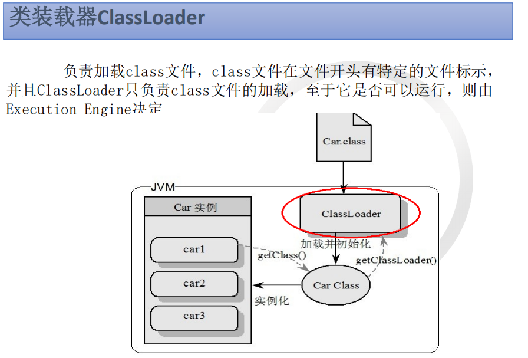
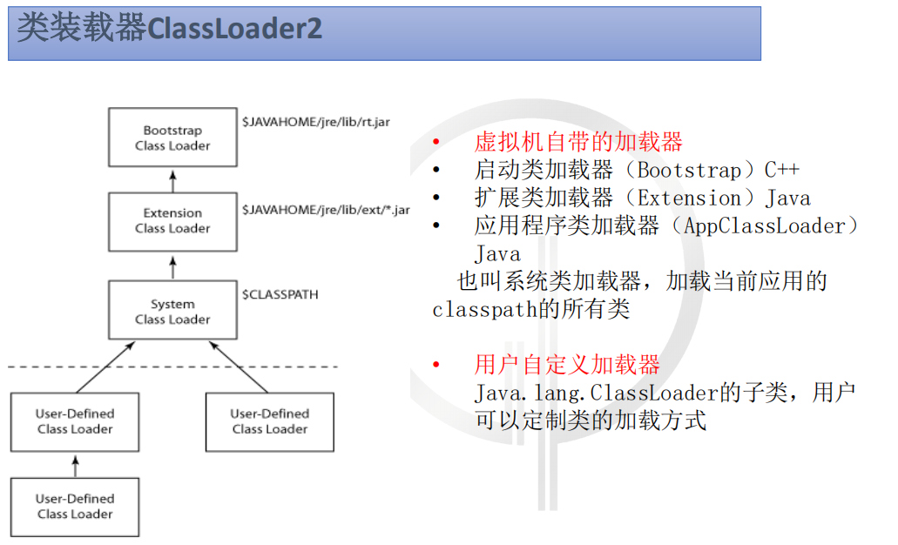
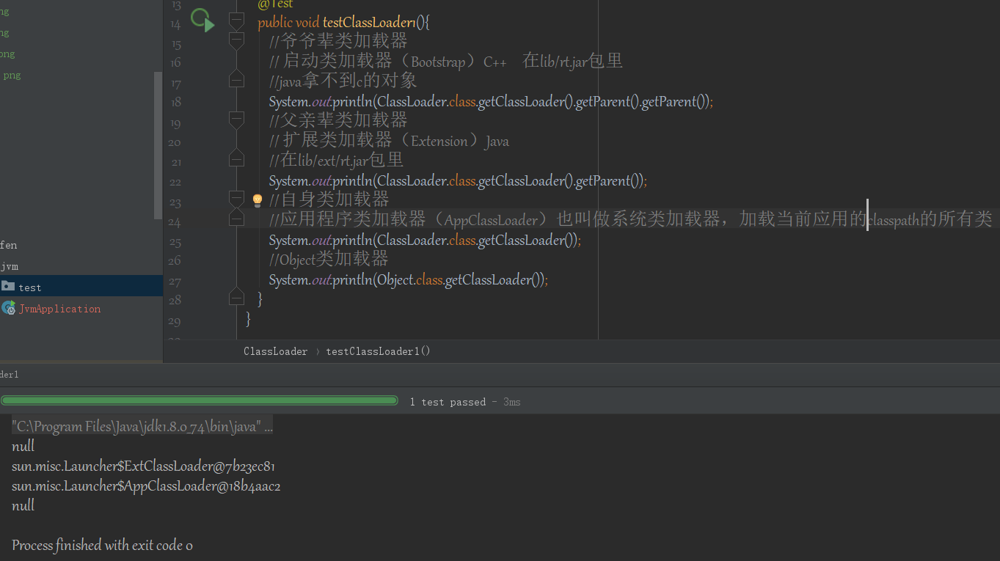
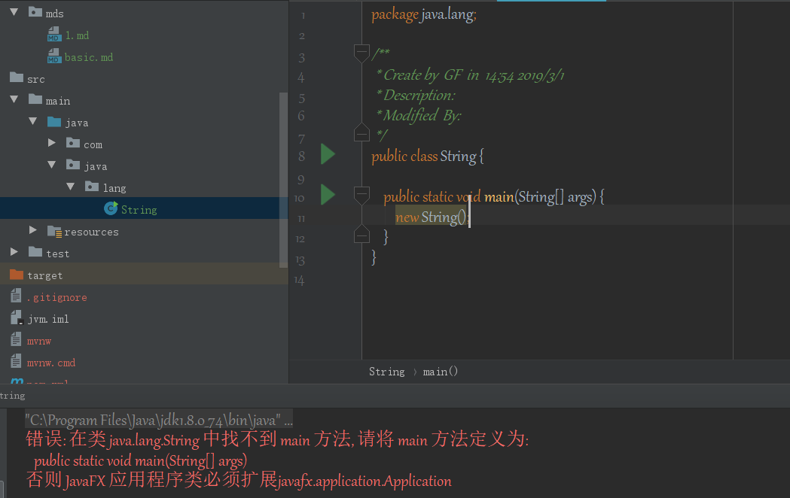

#类装载器

　

　

　

　　• 什么是双亲委派模型？

　　双亲委派模型工作过程是：如果一个类加载器收到类加载的请求，
它首先不会自己去尝试加载这个类，而是把这个请求委派给
父类加载器完成。每个类加载器都是如此，只有当父加载器在
自己的搜索范围内找不到指定的类时（即ClassNotFoundException），
子加载器才会尝试自己去加载。

　　• 为什么需要双亲委派模型？
                
　　有了双亲委派模型，黑客自定义的java.lang.String类永远都不会被加载进内存。
因为首先是最顶端的类加载器加载系统的java.lang.String类，最终自定义的类加载器
无法加载java.lang.String类。

　

　　在自定义的类加载器里面强制加载自定义的java.lang.String类，不去通过调用父加载器不就好了吗?
确实，这样是可行。但是，在JVM中，判断一个对象是否是某个类型时，如果该对象的实际类型
与待比较的类型的类加载器不同，那么会返回false。

　　• 如何实现双亲委派模型？

　　双亲委派模型的原理很简单，实现也简单。每次通过先委托父类加载器加载，
当父类加载器无法加载时，再自己加载。其实ClassLoader类默认的loadClass方法已经帮
我们写好了，我们无需去写。

　　• 自定义类加载器

https://www.cnblogs.com/wxd0108/p/6681618.html   

　　对于java.lang.ClassLoader的loadClass(String name, boolean resolve)方法的解析来看，可以得出以下2个结论：

　　1、如果不想打破双亲委派模型，那么只需要重写findClass方法即可

　　2、如果想打破双亲委派模型，那么就重写整个loadClass方法

(https://github.com/151119011148/study/tree/master/jdk/note/mds/Basic.md)

　　• 沙箱机制  

https://github.com/151119011148/study/tree/master/jvm/note/mds/basic.md