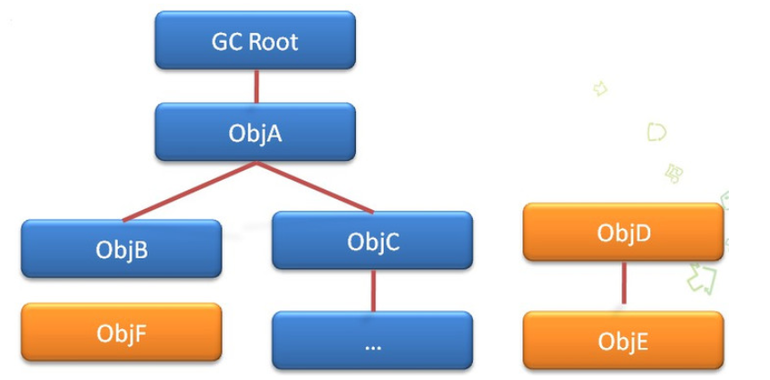
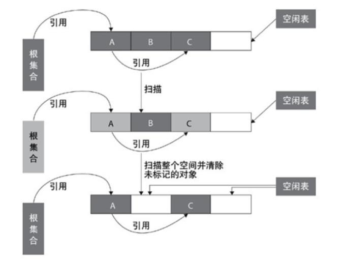
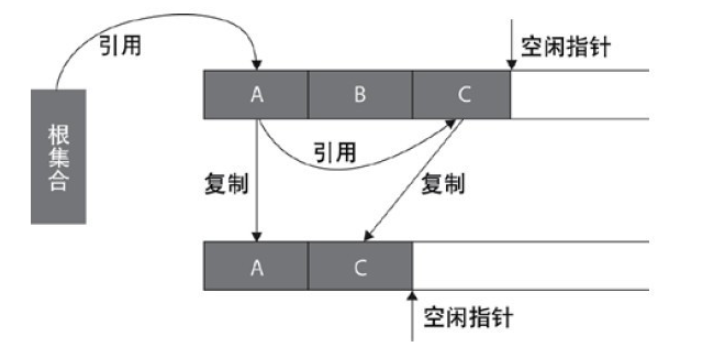
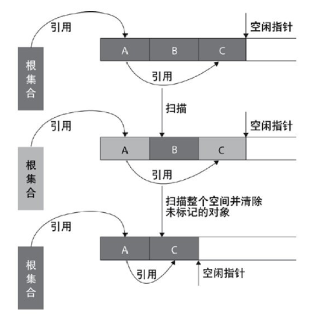
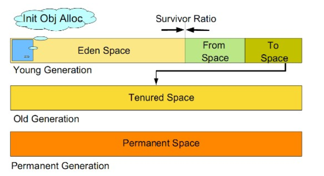

#垃圾回收

⚫ 如何判断对象为垃圾对象

引用计数法
            
　　引用计数是垃圾收集器中的早期策略。在这种方法中，堆中每个对象实例
都有一个引用计数。当一个对象被创建时，且将该对象实例分配给一个变量，该
变量计数设置为1。当任何其它变量被赋值为这个对象的引用时，计数加1（a = b,则b
引用的对象实例的计数器+1），但当一个对象实例的某个引用超过了生命周期或者
被设置为一个新值时，对象实例的引用计数器减1。任何引用计数器为0的对象实例
可以被当作垃圾收集。当一个对象实例被垃圾收集时，它引用的任何对象实例的
引用计数器减1。
            
　　引用计数收集器可以很快的执行，交织在程序运行中。对程序需要不被长时间
打断的实时环境比较有利。

　　无法检测出循环引用。如父对象有一个对子对象的引用，子对象反过来引用父
对象。这样，他们的引用计数永远不可能为0.

　　可达性分析

　　可达性分析是从离散数学中的图论引入的，程序把所有的引用关系看作一张图，
从一个节点GC ROOT开始，寻找对应的引用节点，找到这个节点以后，继续寻找这个节点的
引用节点，当所有的引用节点寻找完毕之后，剩余的节点则被认为是没有被引用到的节点，
即无用的节点。

　　　

　　可以作为GCRoot的对象：

　　• 虚拟机栈(局部变量表中的)
　　• 方法区的类属性所引用的对象
　　• 方法区的常量所引用的对象
　　• 本地方法栈所引用的对象
            
　　⚫ 如何回收垃圾？

　　*标记清除（Mark Sweep）

　　　

　　标记-清除算法采用从根集合进行扫描，对存活的对象对象标记，标记完毕后，再扫描
整个空间中未被标记的对象，进行回收，如上图所示。标记-清除算法不需要进行对象的移动，
并且仅对不存活的对象进行处理，在存活对象比较多的情况下极为高效，但由于标记-清除算法
直接回收不存活的对象，因此会造成内存碎片。

　　*复制算法（Copy）

　　　

　　该算法的提出是为了克服句柄的开销和解决堆碎片的垃圾回收。它开始时把堆分成 一个
对象 面和多个空闲面， 程序从对象面为对象分配空间，当对象满了，基于copying算法的垃圾 收集
就从根集中扫描活动对象，并将每个 活动对象复制到空闲面(使得活动对象所占的内存之间没有
空闲洞)，这样空闲面变成了对象面，原来的对象面变成了空闲面，程序会在新的对象面中分配
内存。一种典型的基于coping算法的垃圾回收是stop-and-copy算法，它将堆分成对象面和空闲区域面，在
对象面与空闲区域面的切换过程中，程序暂停执行。

　　*标记整理（Mark Compact）

　　

　　标记-整理算法采用标记-清除算法一样的方式进行对象的标记，但在清除时不同，在回收
不存活的对象占用的空间后，会将所有的存活对象往左端空闲空间移动，并更新对应的指针。
标记-整理算法是在标记-清除算法的基础上，又进行了对象的移动，因此成本更高，但是却解决了
内存碎片的问题。在基于Compacting算法的收集器的实现中，一般增加句柄和句柄表。　

　　*分代回收算法（Generational Collector）

　　分代的垃圾回收策略，是基于这样一个事实：不同的对象的生命周期是不一样的。因此，
不同生命周期的对象可以采取不同的回收算法，以便提高回收效率。

　　

　　•年轻代（Young Generation）

    　　1.所有新生成的对象首先都是放在年轻代的。年轻代的目标就是尽可能快速的收集掉那些
    生命周期短的对象。
    
    　　2.新生代内存按照8:1:1的比例分为一个eden区和两个survivor(survivor0,survivor1)区。一个Eden区，
    两个 Survivor区(一般而言)。大部分对象在Eden区中生成。回收时先将eden区存活对象复制到一个
    survivor0区，然后清空eden区，当这个survivor0区也存放满了时，则将eden区和survivor0区存活对象
    复制到另一个survivor1区，然后清空eden和这个survivor0区，此时survivor0区是空的，然后将survivor0区
    和survivor1区交换，即保持survivor1区为空， 如此往复。
    
    　　3.当survivor1区不足以存放 eden和survivor0的存活对象时，就将存活对象直接存放到老年代。
    若是老年代也满了就会触发一次Full GC，也就是新生代、老年代都进行回收
    
    　　4.新生代发生的GC也叫做Minor GC，MinorGC发生频率比较高(不一定等Eden区满了才触发)

　　•年老代（Old Generation）

    　　1.在年轻代中经历了N次垃圾回收后仍然存活的对象，就会被放到年老代中。因此，可以认为
    年老代中存放的都是一些生命周期较长的对象。
    
    　　2.内存比新生代也大很多(大概比例是1:2)，当老年代内存满时触发Major GC即Full GC，Full GC发生频率
    比较低，老年代对象存活时间比较长，存活率标记高。

　　•持久代（Permanent Generation）

    　　用于存放静态文件，如Java类、方法等。持久代对垃圾回收没有显著影响，但是有些应用可能
    动态生成或者调用一些class，例如Hibernate 等，在这种时候需要设置一个比较大的持久代空间来存放
    这些运行过程中新增的类。

　　⚫ 垃圾收集器（GC）

　　新生代收集器使用的收集器：Serial、PraNew、Parallel Scavenge

　　老年代收集器使用的收集器：Serial Old、Parallel Old、CMS

　　•Serial收集器（复制算法)

　　新生代单线程收集器，标记和清理都是单线程，优点是简单高效。

　　•Serial Old收集器(标记-整理算法)

　　老年代单线程收集器，Serial收集器的老年代版本。

　　•ParNew收集器(停止-复制算法)　

　　新生代收集器，可以认为是Serial收集器的多线程版本,在多核CPU环境下有着比Serial更好的表现。

　　•Parallel Scavenge收集器(停止-复制算法)

　　并行收集器，追求高吞吐量，高效利用CPU。吞吐量一般为99%， 
吞吐量= 用户线程时间/(用户线程时间+GC线程时间)。适合后台应用等对交互相应要求不高的场景。

　　•Parallel Old收集器(停止-复制算法)

　　Parallel Scavenge收集器的老年代版本，并行收集器，吞吐量优先

　　•CMS(Concurrent Mark Sweep)收集器（标记-清理算法）

　　高并发、低停顿，追求最短GC回收停顿时间，cpu占用比较高，响应时间快，停顿时间短，
多核cpu 追求高响应时间的选择

　　⚫ GC执行机制

　　由于对象进行了分代处理，因此垃圾回收区域、时间也不一样。GC有两种类型：Scavenge GC和Full GC。

　　•Scavenge GC

　　一般情况下，当新对象生成，并且在Eden申请空间失败时，就会触发Scavenge GC，对Eden区域
进行GC，清除非存活对象，并且把尚且存活的对象移动到Survivor区。然后整理Survivor的两个区。
这种方式的GC是对年轻代的Eden区进行，不会影响到年老代。因为大部分对象都是从Eden区开始
的，同时Eden区不会分配的很大，所以Eden区的GC会频繁进行。因而，一般在这里需要使用速度
快、效率高的算法，使Eden去能尽快空闲出来。

　　•Full GC

　　对整个堆进行整理，包括Young、Tenured和Perm。Full GC因为需要对整个堆进行回收，所以比
Scavenge GC要慢，因此应该尽可能减少Full GC的次数。在对JVM调优的过程中，很大一部分工作就是
对于FullGC的调节。有如下原因可能导致Full GC：

    　　1.年老代（Tenured）被写满
    　　2.持久代（Perm）被写满 
    　　3.System.gc()被显示调用 
    　　4.上一次GC之后Heap的各域分配策略动态变化
    
    
　　⚫ 内存泄漏问题

　　1.静态集合类像HashMap、Vector等的使用最容易出现内存泄露，这些静态变量的生命周期和应用
程序一致，所有的对象Object也不能被释放，因为他们也将一直被Vector等应用着。

　　2.各种连接，数据库连接，网络连接，IO连接等没有显示调用close关闭，不被GC回收导致内存泄露。

　　3.监听器的使用，在释放对象的同时没有相应删除监听器的时候也可能导致内存泄露。