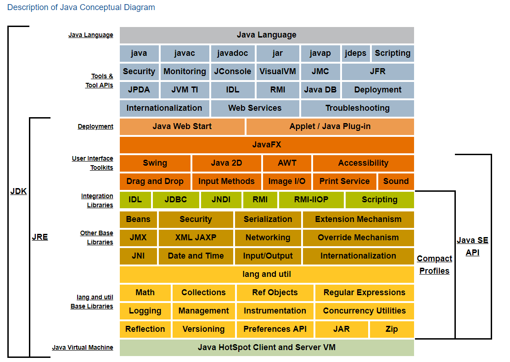
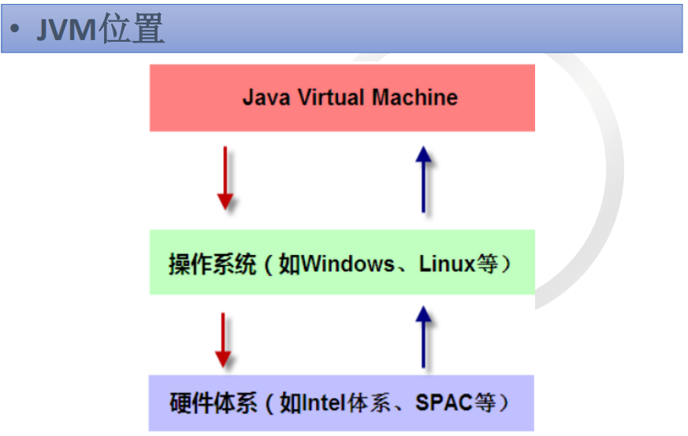
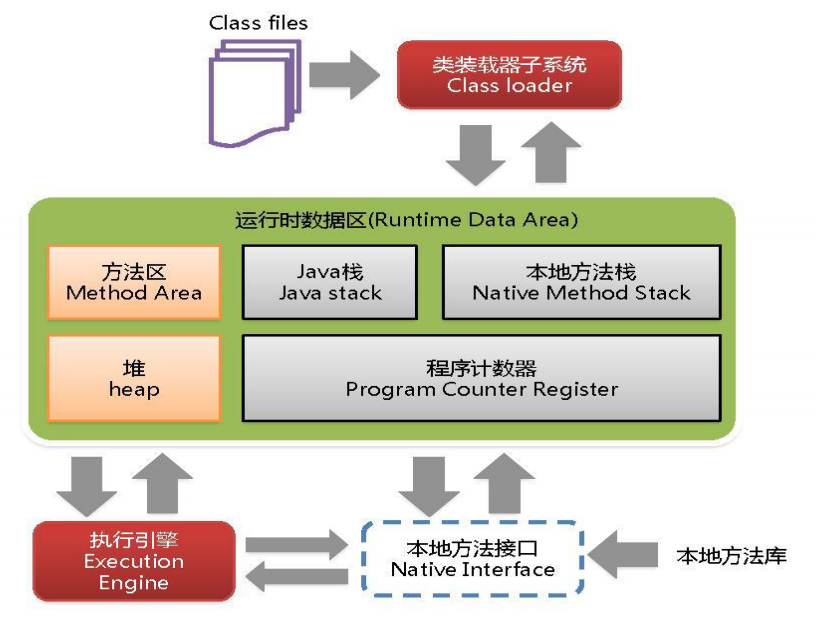

#JVM

一、什么是JVM？
 
　　Java Virtual Machine，java虚拟机。

　　java -version
    
　　Java HotSpot(TM) Client VM (build 14.3-b01, mixed mode, sharing)
    
　　mixed mode 解释与编译 混合的执行模式 默认使用这种模式

      　

二、JVM的位置
 
　
 
三、JVM结构

　

　　由上图可知JVM基本机构包括：类加载器、内存区域、执行引擎、本地库接口 。

　　* 类装载器

(https://github.com/151119011148/study/tree/master/jvm/note/mds/classLoader.md)     
　　
　　* 内存区

(https://github.com/151119011148/study/tree/master/jvm/note/mds/memoryArea.md)     

　　* 执行引擎

执行引擎负责解释命令，提交操作系统执行（Execution Engine）

　　* 本地库接口

本地接口的作用是融合不同的编程语言为 Java 所用;

 