#J内存区

　　内存区（也叫运行时数据区），运行时内存区主要可以划分为5个区域：

　　1. JVM栈 (Java Virtual Machine Stacks) 
    
　　2. 堆内存 (Heap Memory) 
    
　　3. 方法区 (Method Area) 
    
　　4. 本地方法栈 (Native Method Stacks) 
    
　　5. 程序计数器 (Program Counter (PC) Register)

　　1. JVM栈 (Java Virtual Machine Stacks) 

　　每当启动一个新线程的时候，java虚拟机都会为它分配一个java栈。java以栈帧为单位
保存线程的运行状态。虚拟机只会对java栈执行两种操作：以栈帧为单位的压栈或者出栈。

　　每个线程包含一个栈区，栈中只保存基础数据类型的对象和自定义对象的引用(不是对象)，
对象都存放在堆区中 。

　　每个栈中的数据(原始类型和对象引用)都是私有的，其他栈不能访问。 

　　栈分为3个部分：基本类型变量区、执行环境上下文、操作指令区(存放操作指令)。

　　栈内存，主管Java程序的运行，是在线程创建时创建，它的生命期是跟随线程的
生命期，线程结束栈内存也就释放，对于栈来说不存在垃圾回收问题，只要线程一结束该栈就
Over，生命周期和线程一致，是线程私有的。8种基本类型的变量+对象的引用变量+实例方法
都是在函数的栈内存中分配。

　　• 栈存储什么?

　　局部变量表:输入参数和输出参数以及方法内的变量类型；局部变量表在编译期间完成分配，
当进入一个方法时，这个方法在帧中分配多少内存是固定的
    
　　栈操作（Operand Stack）:记录出栈、入栈的操作；
　　动态链接
　　方法出口

　　• 栈溢出    

　　StackOverflowError,OutOfMemory

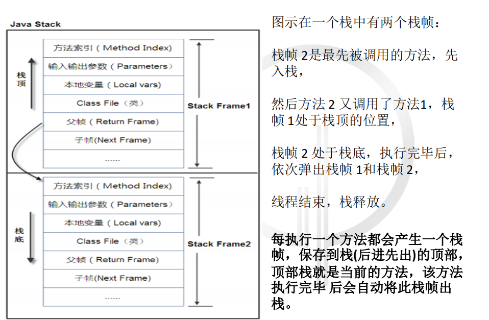　

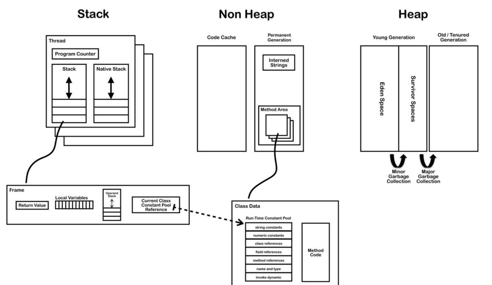　

　　2. 本地方法栈 (Native Method Stacks) 

　　和java栈的作用差不多，只不过是为JVM使用到的native方法服务的。

　　Java官方对于本地方法的定义为methods written in a language other than the Java programming language，
就是使用非Java语言实现的方法，但是通常我们指的一般为C或者C++，因此这个栈也有着C栈这一称号。
一个不支持本地方法执行的JVM没有必要实现这个数据区域。本地方法栈基本和JVM栈一样，
其大小也是可以设置为固定值或者动态增加，因此也会对应抛出StackOverflowError和OutOfMemoryError错误。 

　　在HotSopt虚拟机中直接就把本地方法栈和Java栈合二为一。

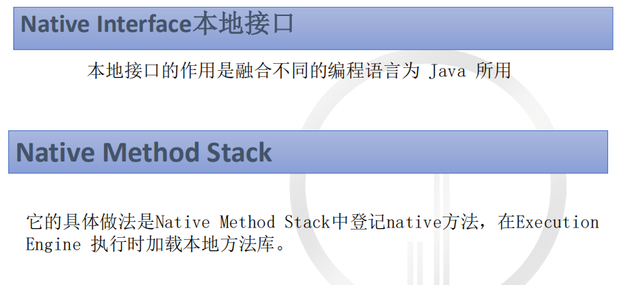 

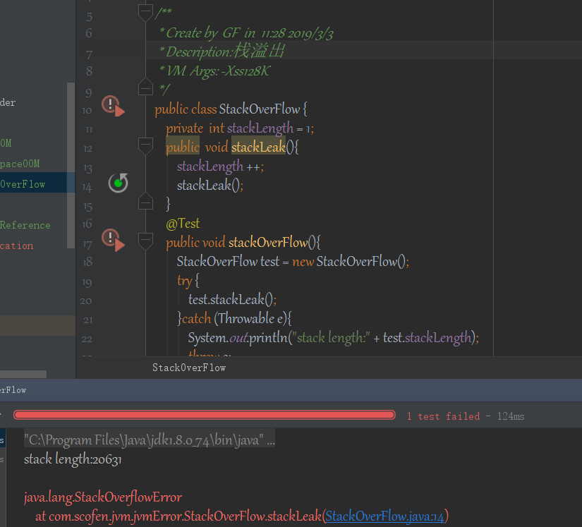 

　　3. 堆内存 (Heap Memory) 

　　存储的全部是对象，每个对象包含一个与之对应的class信息–class的目的是得到操作指令。

　　jvm只有一个堆区（heap）被所有线程共享，堆区中不存放基本类型和对象引用，只存放对象本身。  

　　堆的优势是可以动态地分配内存大小，生存期也不必事先告诉编译器，因为它是在运行时动态
分配内存的，Java的垃圾收集器会自动收走这些不再使用的数据。 

　　缺点是，由于要在运行时动态分配内存，存取速度较慢

　　堆内存的大小是可以调节的。类加载器读取了类文件后，需要把类、方法、常变量放到
　　堆内存中，保存所有引用类型的真实信息，以方便执行器执行，堆内存分为三部分：

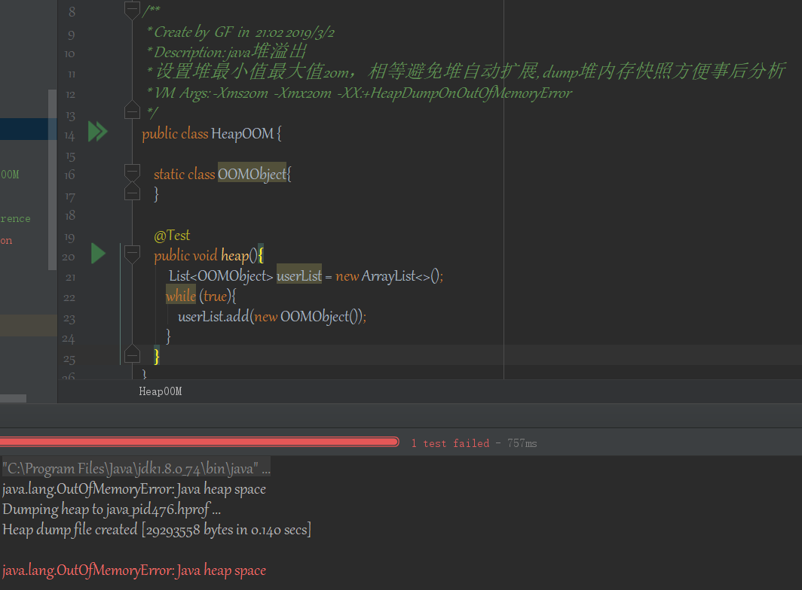 

　　⚫ Young Generation Space 新生区  
　　⚫ Tenure generation space 养老区
　　⚫ Permanent Space 永久区 Perm

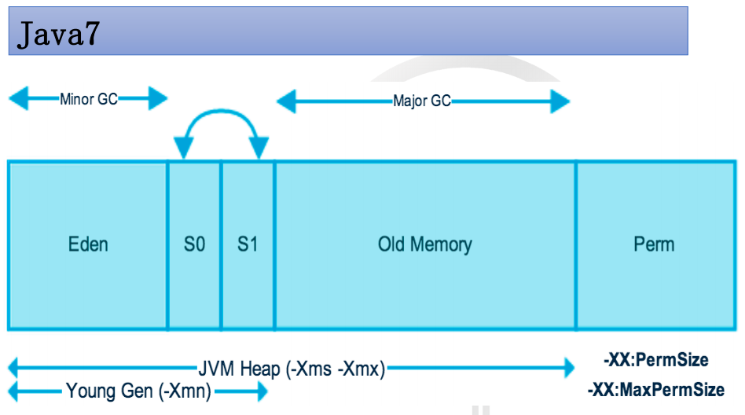 

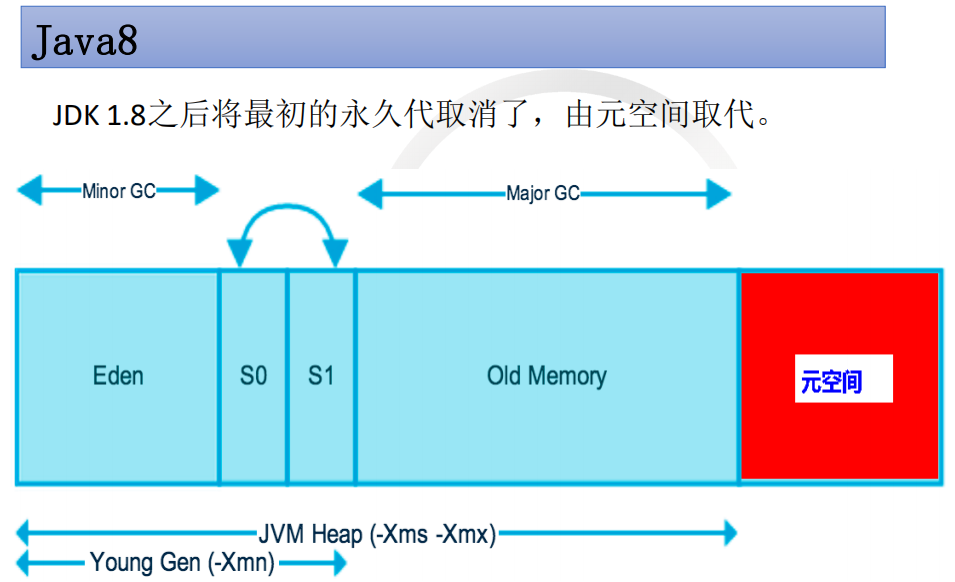 

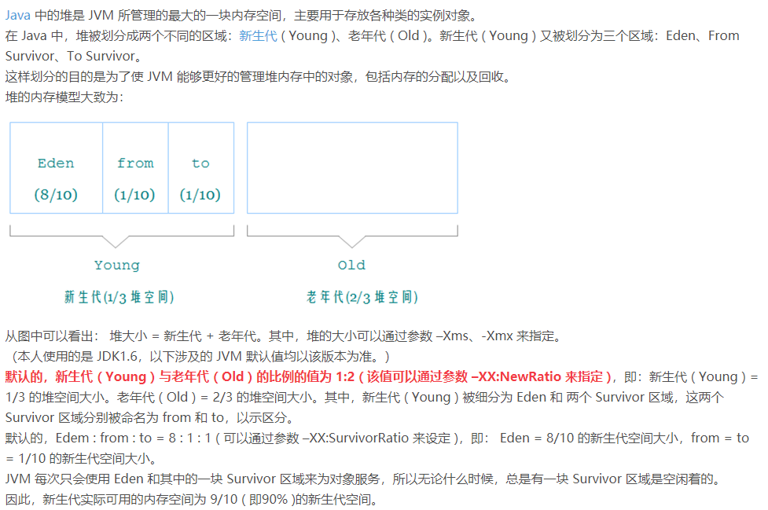 

　　• 对象的创建    

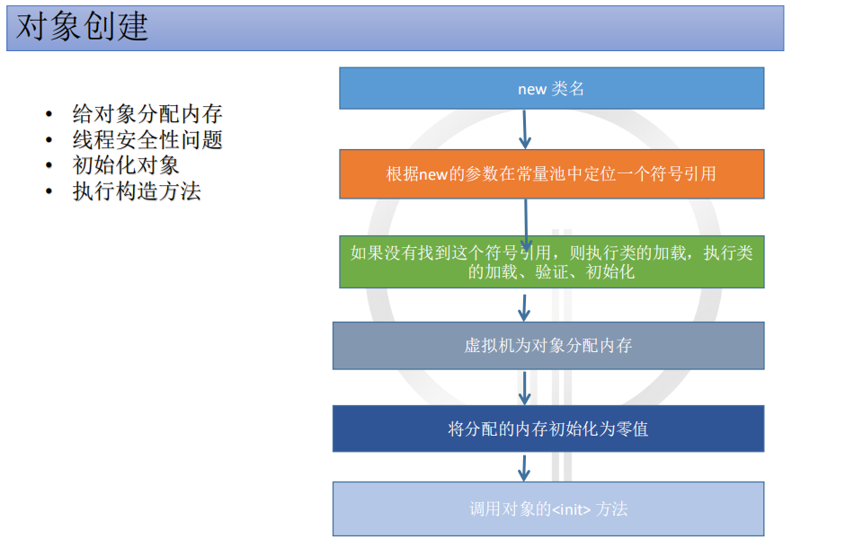 

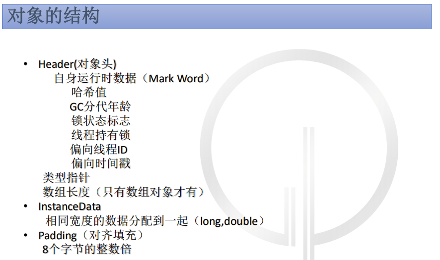 

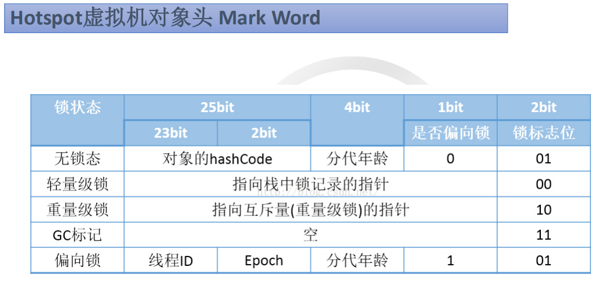 

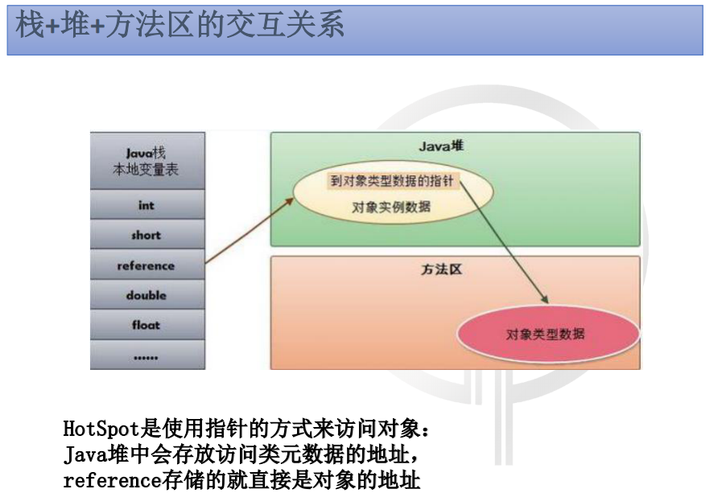 

　　4. 方法区 (Method Area) 

　　在方法区中，存储了每个类的信息（包括类的名称、方法信息、字段信息）、静态变量、常量以及编译器编译后的代码等。

　　在Class文件中除了类的字段、方法、接口等描述信息外，还有一项信息是常量池，用来存储编译期间生成的字面量和符号引用。

　　在方法区中有一个非常重要的部分就是运行时常量池，它是每一个类或接口的常量池的运行时表示形式，在类和接口被加载到JVM后，
对应的运行时常量池就被创建出来。

　　当然并非Class文件常量池中的内容才能进入运行时常量池，在运行期间也可将新的常量放入运行时常量池中，比如String的intern方法。
虽然JVM规范把方法区描述为堆的一个逻辑部分， 但它却有个别名non-heap（非堆）。

　　• 方法区和永久代的关系     

　　永久存储区是一个常驻内存区域，用于存放JDK自身所携带的 Class,Interface
的元数据，也就是说它存储的是运行环境必须的类信息，被装载进此区域的数据是不会
被垃圾回收器回收掉的，关闭 JVM 才会释放此区域所占用的内存。

　　如果出现java.lang.OutOfMemoryError: PermGen space，说明是Java虚拟机对
永久代Perm内存设置不够。一般出现这种情况，都是程序启动需要加载大量的第三方jar
包。例如：在一个Tomcat下部署了太多的应用。或者大量动态反射生成的类不断被加载，
最终导致Perm区被占满。

　　Jdk1.6及之前： 有永久代, 常量池1.6在方法区
　　Jdk1.7： 有永久代，但已经逐步“去永久代”，常量池1.7在堆
　　Jdk1.8及之后： 无永久代，常量池1.8在元空间

　　方法区（Method Area），是各个线程共享的内存区域，它用于存储虚拟机加载的：
类信息+普通常量+静态常量+编译器编译后的代码等等，虽然JVM规范将方法区描述为堆
的一个逻辑部分，但它却还有一个别名叫做Non-Heap(非堆)，目的就是要和堆分开。
对于HotSpot虚拟机，很多开发者习惯将方法区称之为“永久代(Parmanent
Gen)” ，但严格本质上说两者不同，或者说使用永久代来实现方法区而已，永久代是方
法区(相当于是一个接口interface)的一个实现，jdk1.7的版本中，已经将原本放在永久代的
字符串常量池移走。

　　常量池（Constant Pool）是方法区的一部分，Class文件除了有类的版本、字段、
方法、接口等描述信息外，还有一项信息就是常量池，这部分内容将在类加载后进入方
法区的运行时常量池中存放

　　• 方法区的运行常量池

　　它是方法区的一部分，用于存放编译期生成的各种字面量和符号
引用，这部分内容将在类加载后存放到常量池中

　　5. PC寄存器

　　程序计数器是一块较小的内存空间，是当前线程所执行的字节码的行号指示器 ,
用于保存当前线程执行的内存地址。
    
　　由于JVM程序是多线程执行的（线程轮流切换），所以为了保证线程切换回来后，
还能恢复到原先状态，就需要一个独立的计数器，记录之前中断的地方，
可见程序计数器也是线程私有的。

　　如果线程执行的是java方法，记录的是正在执行的虚拟机字节
码指令的地址，如果是native方法，这个计数器值为undefined     
    
　　注意这个区域是唯一一个不抛出OutOfMemoryError的运行时数据区