#mysql体系结构

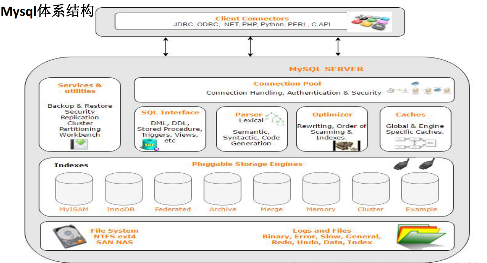　
  
 * Client Connectors：
 接入方支持协议很多
 
 * Management Serveices & Utilities：
 系统管理和控制工具，mysqldump、 mysql复制集群、分区管理等
 
 * Connection Pool：
 连接池：管理缓冲用户连接、用户名、密码、权限校验、线程处理等需要缓存的需求
 
 * SQL Interface：
 SQL接口：接受用户的SQL命令，并且返回用户需要查询的结果
 
 * Parser：
 解析器，SQL命令传递到解析器的时候会被解析器验证和解析。解析器是由Lex和YACC实现的
 
 * Optimizer：
 查询优化器，SQL语句在查询之前会使用查询优化器对查询进行优化
 
 * Cache和Buffer（高速缓存区）：
 查询缓存，如果查询缓存有命中的查询结果，查询语句就可以直接去查询缓存中取数据
  
  * pluggable storage Engines：
 插件式存储引擎。存储引擎是MySql中具体的与文件打交道的子系统
  
  * file system：
 文件系统，数据、日志（redo，undo）、索引、错误日志、查询记录、慢查询等
 

　　索引是什么？

* 索引是为了加速对表中数据行的检索而创建的一种分散存储（硬盘，内存不连续）的
数据结构

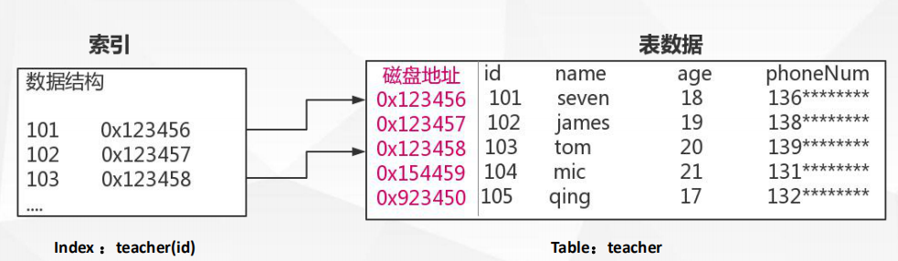
 
　　为什么要用索引？

* 正确的创建合适的索引，是提升数据库查询性能的基础
* 索引能极大的减少存储引擎需要扫描的数据量
* 索引可以把随机IO变成顺序IO
* 索引可以帮助我们在进行分组、排序等操作时，避免使
用临时表

　　为什么是B+Tree？

* 平衡二叉查找树：

    它太深了
    数据处的（高）深度决定着他的IO操作次数，IO操作耗时大
    
    它太小了
    每一个磁盘块（节点/页）保存的数据量太小了
    没有很好的利用操作磁盘IO的数据交换特性，
    也没有利用好磁盘IO的预读能力（空间局部性原理），从而带来频繁的IO操作
    
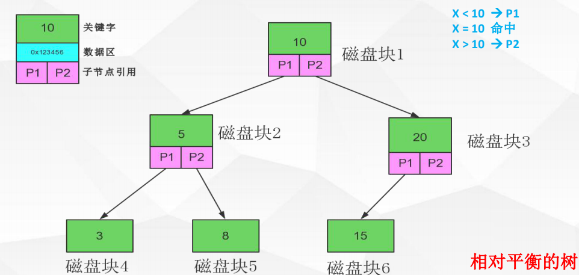

* 多路平衡查找树B-Tree：

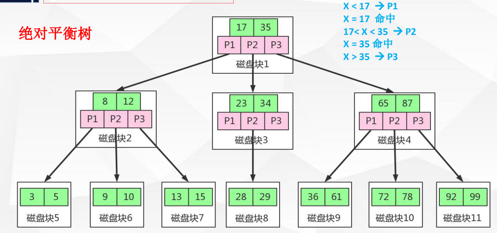
 
 * 加强多路平衡查找树B+Tree：
 
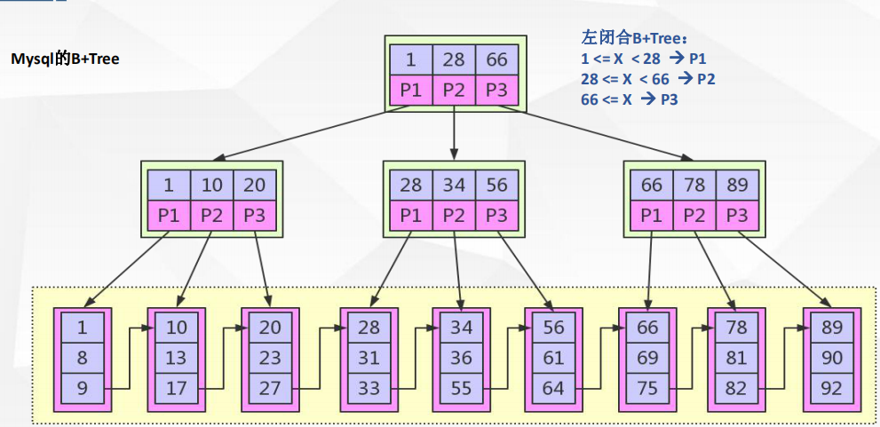
  
  
　　什么是B+Tree？
    
    1，B+节点关键字搜索采用闭合区间
    2，B+非叶节点不保存数据相关信息，只保存关键字和子节点的引用
    3，B+关键字对应的数据保存在叶子节点中
    4，B+叶子节点是顺序排列的，并且相邻节点具有顺序引用的关系
      
　　为什么选择B+Tree？

    B+树是B-树的变种（PLUS版）多路绝对平衡查找树，他拥有B-树的优势
    B+树扫库、表能力更强
    B+树的磁盘读写能力更强
    B+树的排序能力更强
    B+树的查询效率更加稳定（仁者见仁、智者见智）
    
    
　　Mysql B+Tree索引体现形式

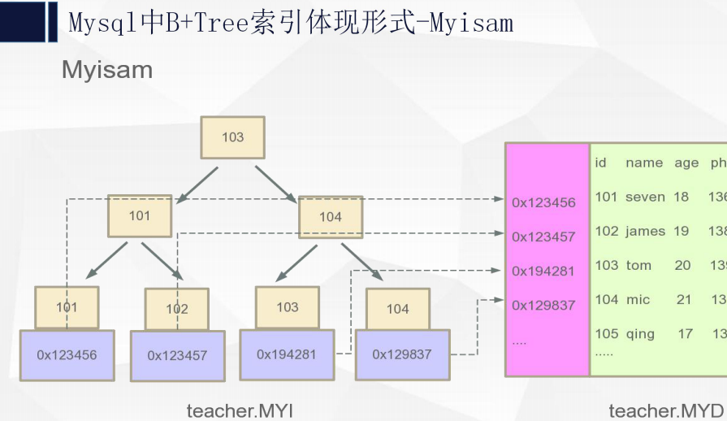

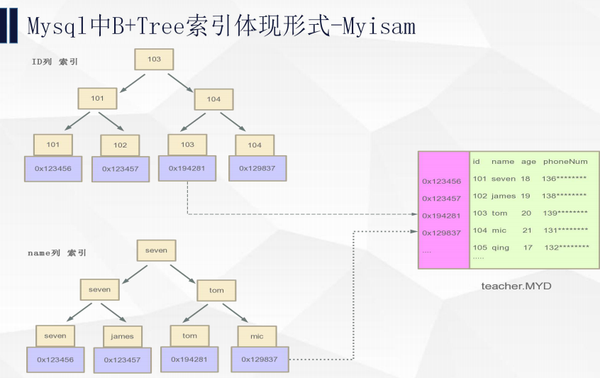

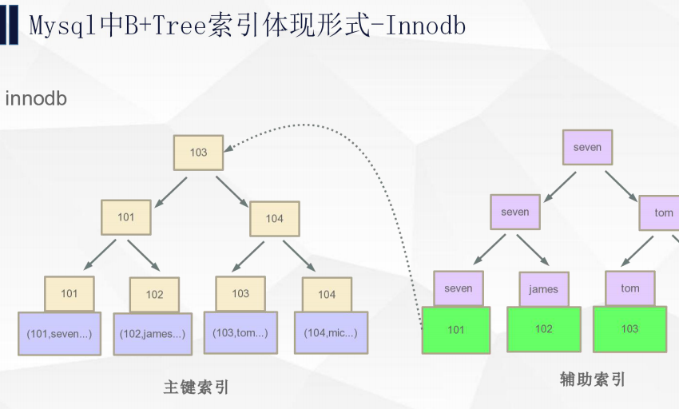
   
　　Mysql myisam和innodb的对比

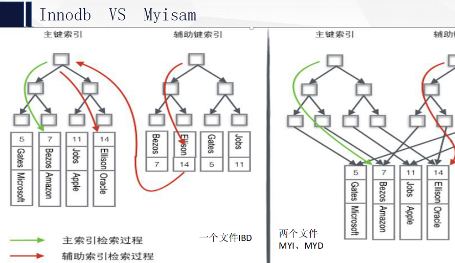
   
   
   索引知识补充：
   
       索引列的数据长度能少则少。
       索引一定不是越多越好，越全越好，一定是建合适的。
       匹配列前缀可用到索引 like 9999%，like %9999%、like %9999用不到索引；
       Where 条件中 not in 和 <>操作无法使用索引；
       匹配范围值，order by 也可用到索引；
       多用指定列查询，只返回自己想到的数据列，少用select *；
       联合索引中如果不是按照索引最左列开始查找，无法使用索引；
       联合索引中精确匹配最左前列并范围匹配另外一列可以用到索引；
       联合索引中如果查询中有某个列的范围查询，则其右边的所有列都无法使用索引；
       
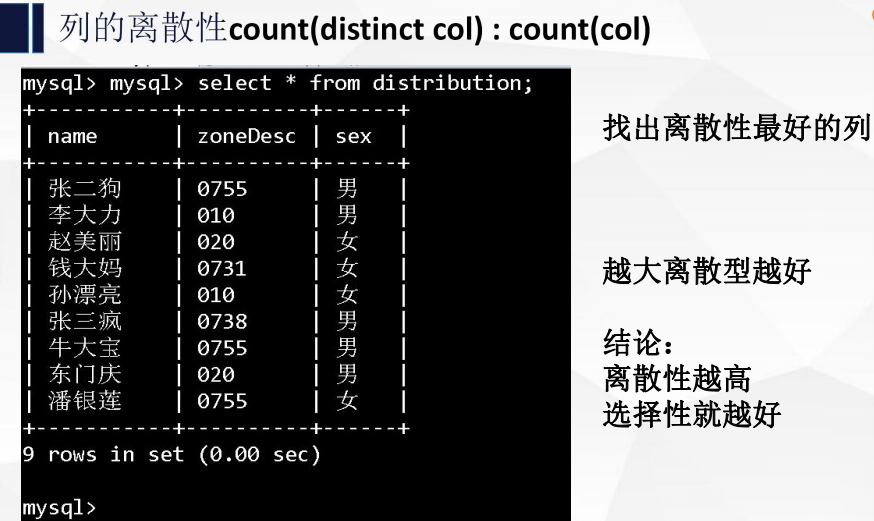

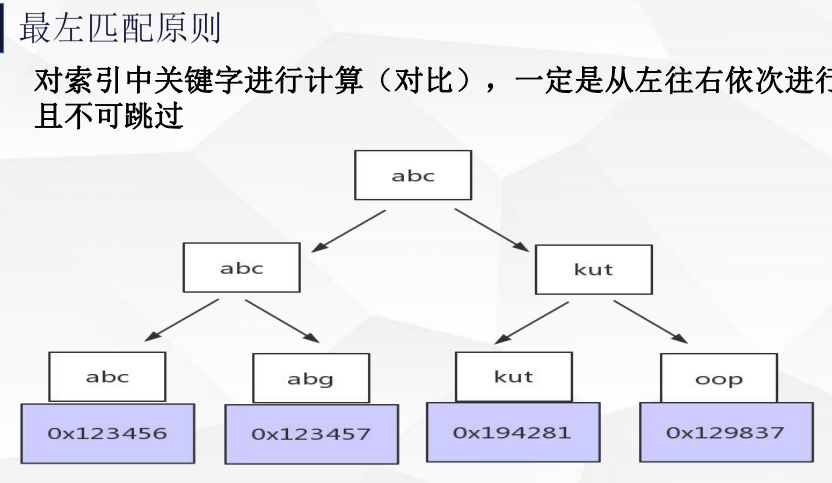

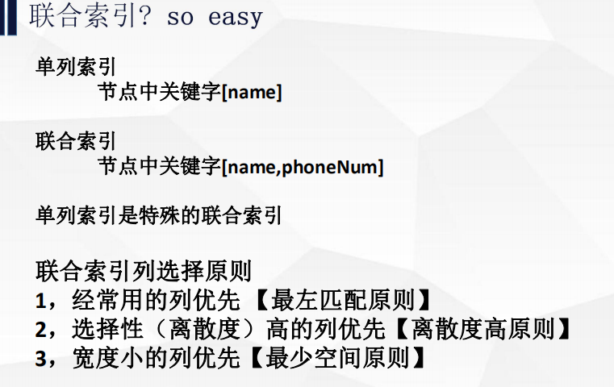

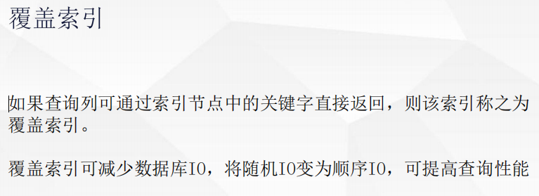