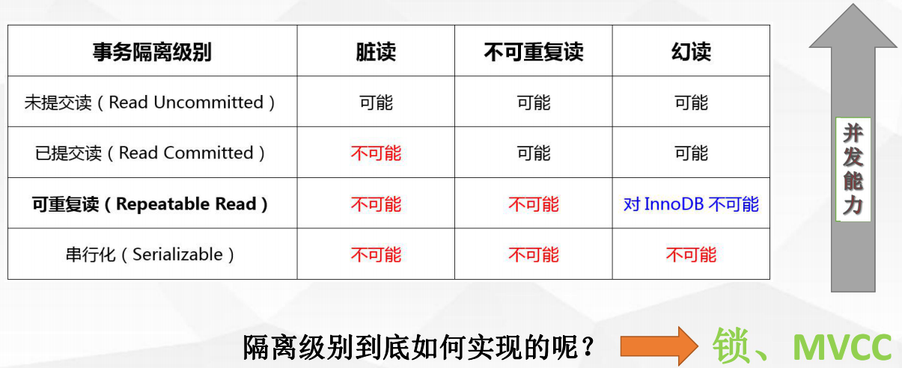

#Mysql查询优化

事务、锁

一、事务

* 事务:
    数据库操作的最小工作单元，是作为单个逻辑工作单元执行的一系列操作；   
    事务是一组不可再分割的操作集合（工作逻辑单元）;
    
    
    典型事务场景(转账)：
    update user_account set balance = balance - 1000 where userID = 3;
    update user_account set balance = balance +1000 where userID = 1;
    
    mysql中如何开启事务：
    begin / start transaction -- 手工
    commit / rollback -- 事务提交或回滚
    set session autocommit = on/off; -- 设定事务是否自动开启
    
    JDBC 编程：
    connection.setAutoCommit（boolean）;
    
    Spring 事务AOP编程：
    expression=execution（com.gpedu.dao.*.*(..)）
    
* 事务ACID特性  

    原子性（Atomicity）
    最小的工作单元，整个工作单元要么一起提交成功，要么全部失败回滚
    
    一致性（Consistency）
    事务中操作的数据及状态改变是一致的，即写入资料的结果必须完全符合预设的规则，
    不会因为出现系统意外等原因导致状态的不一致
    
    隔离性（Isolation）
    一个事务所操作的数据在提交之前，对其他事务的可见性设定（一般设定为不可见）
    
    持久性（Durability）
    事务所做的修改就会永久保存，不会因为系统意外导致数据的丢失         
  
* 事务并发带来的问题：

    

    

    

* 事务四种隔离级别

SQL92 ANSI/ISO标准：http://www.contrib.andrew.cmu.edu/~shadow/sql/sql1992.txt

    Read Uncommitted（未提交读） --未解决并发问题
    事务未提交对其他事务也是可见的，脏读（dirty read）
    
    Read Committed（提交读） --解决脏读问题
    一个事务开始之后，只能看到自己提交的事务所做的修改，不可重复读（nonrepeatableread）
    
    Repeatable Read (可重复读) --解决不可重复读问题
    在同一个事务中多次读取同样的数据结果是一样的，这种隔离级别未解决幻读的问题
    
    Serializable（串行化） --解决所有问题
    最高的隔离级别，通过强制事务的串行执行
    
* innodb存储引擎对隔离级别的支持程度

     
 
 innodb最棒的地方在于，它默认可重复读的事务隔离级别下解决了幻读；
 
 
二、锁

* 理解表锁行锁

锁是用于管理不同事务对共享资源的并发访问

    表锁与行锁的区别：
    锁定粒度：表锁 > 行锁
    加锁效率：表锁 > 行锁
    冲突概率：表锁 > 行锁
    并发性能：表锁 < 行锁
    
InnoDB存储引擎只有行锁，描述正确；
InnoDB存储引擎支持行锁和表锁，描述也正确；（另类的行锁）锁住每一行

* innodb锁类型

     
 
    • 共享锁（行锁）：Shared Locks
    • 排它锁（行锁）：Exclusive Locks
    • 意向锁共享锁（表锁）：Intention Shared Locks
    • 意向锁排它锁（表锁）：Intention Exclusive Locks
    • 自增锁：AUTO-INC Locks
    
* 行锁的算法 （https://dev.mysql.com/doc/refman/5.7/en/innodb-locking.html）

    • 记录锁 Record Locks
    • 间隙锁 Gap Locks
    • 临键锁 Next-key Locks
    
* 共享锁（Shared Locks）VS排他锁（Exclusive Locks），S，X

共享锁:   
　　又称为读锁，简称S锁，顾名思义，共享锁就是多个事务对于同一数据可以共享一把锁，
都能访问到数据，但是只能读不能修改;

加锁释锁方式：

    select * from users WHERE id=1 LOCK IN SHARE MODE;
    commit/rollback

排他锁:   
　　又称为写锁，简称X锁，排他锁不能与其他锁并存，如一个事务获取了一个数据行的排他
锁，其他事务就不能再获取该行的锁（共享锁、排他锁），只有该获取了排他锁的事务是可以对
数据行进行读取和修改，（其他事务要读取数据可来自于快照）

加锁释锁方式：
  
    delete / update / insert 默认加上X锁
    SELECT * FROM table_name WHERE ... FOR UPDATE
    commit/rollback
    
* innodb行锁做了些什么？

　　InnoDB的行锁是通过给索引上的索引项加锁来实现的。

　　只有通过索引条件进行数据检索，InnoDB才使用行级锁，否则，InnoDB将使用表锁（锁住索引的所有记录）

　　表锁：lock tables xx read/write；
    
* 意向锁共享锁（Intention Shared Locks） VS意向锁排它锁（Intention Exclusive Locks）

意向共享锁(IS)  
　　表示事务准备给数据行加入共享锁，即一个数据行加共享锁前必须先取得该表的IS锁，
意向共享锁之间是可以相互兼容的

意向排它锁(IX)  
　　表示事务准备给数据行加入排他锁，即一个数据行加排他锁前必须先取得该表的IX锁，
意向排它锁之间是可以相互兼容的

　　意向锁(IS、IX)是InnoDB数据操作之前自动加的，不需要用户干预

意义：  
　　当事务想去进行锁表时，可以先判断意向锁是否存在，存在时则可快速返回该表不能启用表锁

* 自增锁auto-inc Locks

　　针对自增列自增长的一个特殊的表级别锁

　　show variables like 'innodb_autoinc_lock_mode';
    
　　默认取值1，代表连续，事务未提交ID永久丢失

* 记录锁（Record）、间隙锁（Gap）、临键锁（Next-key）

Next-key locks：      
锁住记录+区间（左开右闭）     

　　当sql执行按照索引进行数据的检索时,查询条件为范围查找（between and、<、>等）并有数
据命中则此时SQL语句加上的锁为Next-key locks，锁住索引的记录+区间（左开右闭）    
　　
Gap locks：
锁住数据不存在的区间（左开右开）   
  
　　当sql执行按照索引进行数据的检索时，查询条件的数据不存在，这时SQL语句加上的锁即为
Gap locks，锁住索引不存在的区间（左开右开）  
　　
Record locks：
锁住具体的索引项       

　　当sql执行按照唯一性（Primary key、Unique key）索引进行数据的检索时，查询条件等值匹
配且查询的数据是存在，这时SQL语句加上的锁即为记录锁Record locks，锁住具体的索引项

* 临键锁（Next-key）

     
　　解决幻读。 
 

* 间隙锁（Gap）

    

* 记录锁（Record）

    
 
 
* 利用锁怎么解决脏读
 
    

* 利用锁怎么解决不可重复读

    

* 利用锁怎么解决幻读

    
    临键锁和MVCC同时作用；
    
    
    
* 死锁

　　多个并发事务（2个或者以上）；   
　　每个事务都持有锁（或者是已经在等待锁）;   
　　每个事务都需要再继续持有锁；   
　　事务之间产生加锁的循环等待，形成死锁。    

*避免 死锁

    • 类似的业务逻辑以固定的顺序访问表和行。
    • 大事务拆小。大事务更倾向于死锁，如果业务允许，将大事务拆小。
    • 在同一个事务中，尽可能做到一次锁定所需要的所有资源，减少死锁概率。
    • 降低隔离级别，如果业务允许，将隔离级别调低也是较好的选择
    • 为表添加合理的索引。可以看到如果不走索引将会为表的每一行记录添加上锁（或者说是表锁）