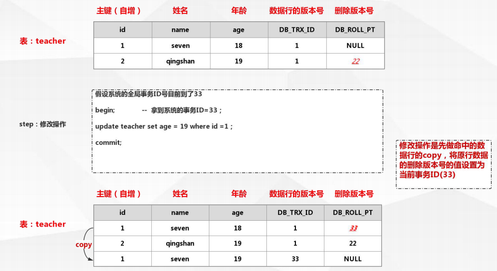
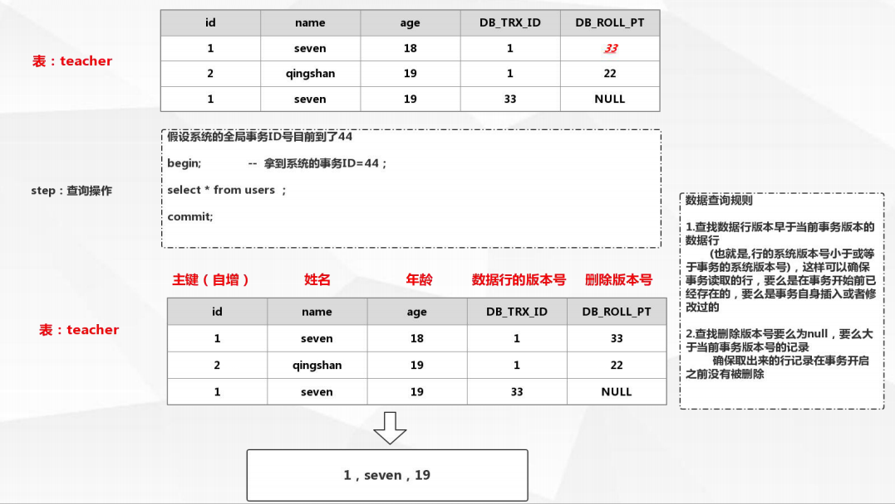
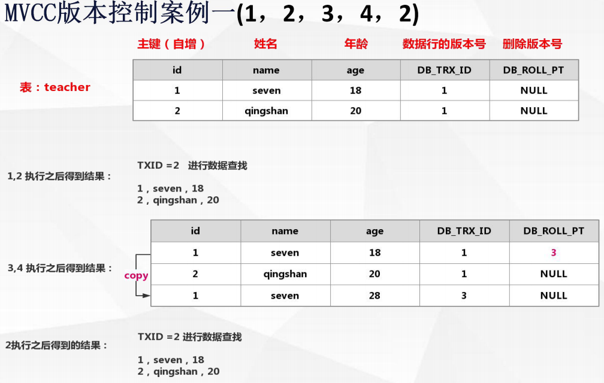
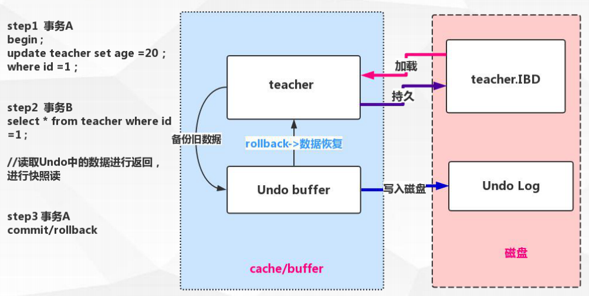
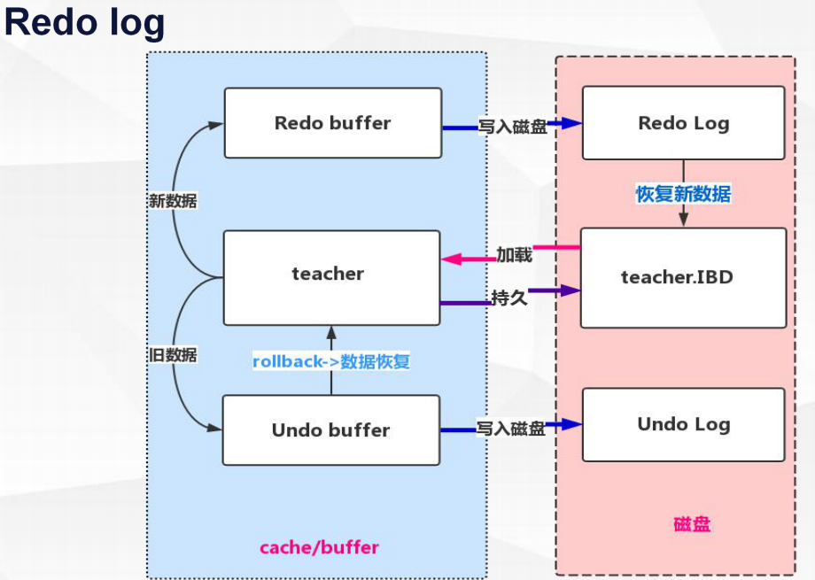

#Mysql查询优化

MVCC

* 什么是MVCC？

MVCC：    
　　Multiversion concurrency control (多版本并发控制)

普通话解释：    
　　并发访问(读或写)数据库时，对正在事务内处理的数据做
多版本的管理。以达到用来避免写操作的堵塞，从而引发读操
作的并发问题。

* MVCC逻辑流程-插入
     

* MVCC逻辑流程-删除
     

* MVCC逻辑流程-修改
  

* MVCC逻辑流程-查询
     

* MVCC版本控制案例

　　数据准备：

    insert into teacher(name,age) value ('seven',18) ;
    insert into teacher(name,age) value ('qing',20) ;
    tx1:
    begin;                                                                              ----------1
    select * from users ;                                                     ----------2
    commit;
    tx2：
    begin;                                                                             ----------3
    update teacher set age =28 where id =1;               ----------4
    commit; 

     

     

* Undo log

    Undo Log 是什么：
    　　undo意为取消，以撤销操作为目的，返回指定某个状态的操作
    undo log指事务开始之前，在操作任何数据之前,首先将需操作的数据备份到一个地方 (Undo Log)

UndoLog是为了实现事务的原子性而出现的产物

    Undo Log实现事务原子性：
    　　事务处理过程中如果出现了错误或者用户执行了 ROLLBACK语句,Mysql可以利用Undo Log中的备份
    将数据恢复到事务开始之前的状态

UndoLog在Mysql innodb存储引擎中用来实现多版本并发控制

    Undo log实现多版本并发控制：
    　　事务未提交之前，Undo保存了未提交之前的版本数据，Undo 中的数据可作为数据旧版本快照供
    其他并发事务进行快照读

    

* 当前读，快照读

快照读：   
　　SQL读取的数据是快照版本，也就是历史版本，普通的SELECT就是快照读
innodb快照读，数据的读取将由 cache(原本数据) + undo(事务修改过的数据) 两部分组成

当前读：   
　　SQL读取的数据是最新版本。通过锁机制来保证读取的数据无法通过其他事务进行修改
UPDATE、DELETE、INSERT、SELECT … LOCK IN SHARE MODE、SELECT … FOR UPDATE都是
当前读

* Redo log

    Redo Log 是什么：
    　　Redo，顾名思义就是重做。以恢复操作为目的，重现操作；
    Redo log指事务中操作的任何数据,将最新的数据备份到一个地方 (Redo Log)
    Redo log的持久：
    　　不是随着事务的提交才写入的，而是在事务的执行过程中，便开始写入redo 中。具体
    的落盘策略可以进行配置
    
RedoLog是为了实现事务的持久性而出现的产物

    Redo Log实现事务持久性：
    　　防止在发生故障的时间点，尚有脏页未写入磁盘，在重启mysql服务的时候，根据redo
    log进行重做，从而达到事务的未入磁盘数据进行持久化这一特性。
    
     

* Redo log补充知识点

　　指定Redo log 记录在{datadir}/ib_logfile1&ib_logfile2 可通过innodb_log_group_home_dir 配置指定
目录存储

　　一旦事务成功提交且数据持久化落盘之后，此时Redo log中的对应事务数据记录就失去了意义，所
以Redo log的写入是日志文件循环写入的

    指定Redo log日志文件组中的数量 innodb_log_files_in_group 默认为2
    指定Redo log每一个日志文件最大存储量innodb_log_file_size 默认48M
    指定Redo log在cache/buffer中的buffer池大小innodb_log_buffer_size 默认16M
    
　　Redo buffer 持久化Redo log的策略， Innodb_flush_log_at_trx_commit：

    　　取值 0 每秒提交 Redo buffer --> Redo log OS cache -->flush cache to disk[可能丢失一秒内
    的事务数据]
    　　取值 1 默认值，每次事务提交执行Redo buffer --> Redo log OS cache -->flush cache to disk
    [最安全，性能最差的方式]
    　　取值 2 每次事务提交执行Redo buffer --> Redo log OS cache 再每一秒执行 ->flush cache to
    disk操作
    
    
* 配置优化   
• mysql服务器参数类型

基于参数的作用域：

全局参数
　　set global autocommit = ON/OFF;

会话参数(会话参数不单独设置则会采用全局参数)
　　set session autocommit = ON/OFF;

注意：
　　全局参数的设定对于已经存在的会话无法生效
　　会话参数的设定随着会话的销毁而失效
　　全局类的统一配置建议配置在默认配置文件中，否则重启服务会导致配置失效

• 配置文件不迷路

    mysql --help 寻找配置文件的位置和加载顺序

    Default options are read from the following files in the given order:
    /etc/my.cnf /etc/mysql/my.cnf /usr/etc/my.cnf ~/.my.cnf

    mysql --help | grep -A 1 'Default options are read from the following
    files in the given order'  
    
• 全局配置文件配置

    最大连接数配置
    　　max_connections
    
    系统句柄数配置
    　　/etc/security/limits.conf
    　　ulimit -a

    mysql句柄数配置
    　　/usr/lib/systemd/system/mysqld.service
    
• 常见全局配置文件配置

    port = 3306
    socket = /tmp/mysql.sock
    basedir = /usr/local/mysql
    datadir = /data/mysql
    pid-file = /data/mysql/mysql.pid
    user = mysql
    bind-address = 0.0.0.0
    max_connections=2000
    lower_case_table_names = 0 #表名区分大小写
    server-id = 1
    tmp_table_size=16M
    transaction_isolation = REPEATABLE-READ
    ready_only=1
    ...
    
• mysql内存参数配置

    每一个connection内存参数配置：
    　　sort_buffer_size connection排序缓冲区大小
     　　建议256K(默认值)-> 2M之内
     　　当查询语句中有需要文件排序功能时，马上为connection分配配置的内
    存大小

    join_buffer_size connection关联查询缓冲区大小
     　　建议256K(默认值)-> 1M之内
     　　当查询语句中有关联查询时，马上分配配置大小的内存用这个关联查
    询，所以有可能在一个查询语句中会分配很多个关联查询缓冲区

    上述配置4000连接占用内存：
     　　4000*(0.256M+0.256M) = 2G
    
    Innodb_buffer_pool_size
    　　innodb buffer/cache的大小（默认128M）
    
    Innodb_buffer_pool
     　　数据缓存
     　　索引缓存
     　　缓冲数据
     　　内部结构
    
    大的缓冲池可以减小多次磁盘I/O访问相同的表数据以提高性能
    
    参考计算公式：
    Innodb_buffer_pool_size = （总物理内存 - 系统运行所用 - connection 所用）* 90%
    
• mysql其他参数配置

    wait_timeout
    　　服务器关闭非交互连接之前等待活动的秒数
    innodb_open_files
    　　限制Innodb能打开的表的个数
    innodb_write_io_threads
    innodb_read_io_threads
    　　innodb使用后台线程处理innodb缓冲区数据页上的读写 I/O(输入输出)请求
    innodb_lock_wait_timeout
    　　InnoDB事务在被回滚之前可以等待一个锁定的超时秒数

https://www.cnblogs.com/wyy123/p/6092976.html 常见配置

• 数据库表设计

    第一范式（ 1NF）：
    　　字段具有原子性,不可再分。 所有关系型数据库系统都满足第一范式）数据库表中的字
    段都是单一属性的， 不可再分；
    
    第二范式（ 2NF）：
    　　要求实体的属性完全依赖于主键。 所谓完全依赖是指不能存在仅依赖主键一部分的属性，
    如果存在， 那么这个属性和主关键字的这一部分应该分离出来形成一个新的实体， 新实体与原
    实体之间是一对多的关系。为实现区分通常需要为表加上一个列，以存储各个实例的惟一标识。
    简而言之， 第二范式就是属性完全依赖主键。
    
    第三范式（ 3NF）：
    　　满足第三范式（ 3NF） 必须先满足第二范式（ 2NF）。 简而言之， 第三范式（ 3NF）
    要求一个数据库表中不包含已在其它表中已包含的非主键信息。
    
    简单一点：
    1， 每一列只有一个单一的值，不可再拆分
    2， 每一行都有主键能进行区分
    3， 每一个表都不包含其他表已经包含的非主键信息。
    
    充分的满足第一范式设计将为表建立太量的列
    　　数据从磁盘到缓冲区，缓冲区脏页到磁盘进行持久的过程中，列的数量过多
    会导致性能下降。过多的列影响转换和持久的性能
    
    过分的满足第三范式化造成了太多的表关联
    　　表的关联操作将带来额外的内存和性能开销
    
    使用innodb引擎的外键关系进行数据的完整性保证
    　　外键表中数据的修改会导致Innodb引擎对外键约束进行检查，就带来了额外
    的开销

    
    
    
    
    
